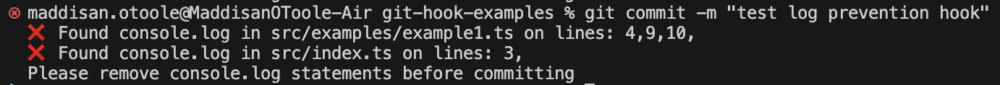
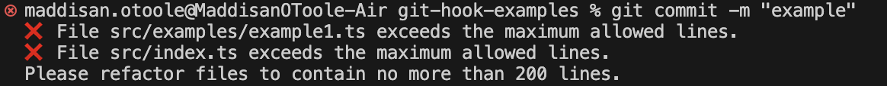
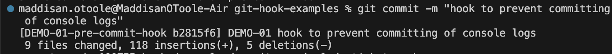

# Examples of Git Hooks
> [!WARNING]
> This repo is a **work in progress**, More details and examples will be added. 

## Overview
Git hooks are Git's in-built method of triggering scripts based on actions. This repo's purpose is to provide an overview of the different types of git hooks and example use cases.

## Table of Contents
1. [Implementation](#implementation)
2. [Different Types of Hooks](#different-types-of-hooks)
   - [Client-Side Hooks](#client-side-hooks)
     - [pre-commit](#pre-commit)
     - [commit-msg](#commit-msg)
     - [pre-push](#pre-push)
   - [Server-Side Hooks](#server-side-hooks)
     - [pre-merge-commit and post-merge](#pre-merge-commit-and-post-merge)
3. [Committing Hooks](#committing-hooks)
4. [Manually tracking and installing hooks](#manually-tracking-and-installing-hooks)
5. [Using a Git Hook Manager (Husky)](#using-a-git-hook-manager-husky)
6. [Resources](#resources)

## Implementation
Hooks are stored in .git/hooks folder. 
By default .git/hooks will be populated with example hooks, if you want to enable them:
1. Remove the ".sample" suffix from the file name
2. Make the hook executable using: `chmod +x .git/hooks/hook-name`
3. Run `npm i` to install them

## Different Types of Hooks

When choosing a Git hook, consider:
- How frequently the hook will be triggered
- How long the hook's operations will take to run
- The impact on developer workflow
- Whether the operation needs to run on every commit or can wait until push

### Client-Side Hooks

#### pre-commit (Runs before every commit)
Analyses staged code. Best suited for quick checks that provide immediate feedback.

Example Use Cases: 
- blocking certain code (e.g console.log)
- checking file size or lines of code exceeds limit
- formatting code

[prevent-console-logs](hooks/examples/pre-commit.prevent-console-logs):
Checks if any staged files contain "console.log", if so, cancels the commit and tells the user what file and line the log is on.



[limit-line-number](hooks/examples/pre-commit.limit-line-number):
Checks if any staged files contain more than a specified line number, if so, cancels the commit and tells the user what files exceed the limit



#### commit-msg (Runs after commit message is entered)
Runs after commit command, can change the contents of a commit message. Ideal for maintaining commit message standards.

Example Use Cases: 
- Adding ticket number to commit msg
- Enforcing commit message format - blocking vague messages (e.g. fix)

[include-ticket-number](hooks/examples/commit-msg.include-ticket-number):
Add ticket numbers to commit messages if they are missing, prevents commits to branches without ticket numbers in their name. This means direct commits to master will be prevented. 



> [!NOTE]
> **pre-commit** and **commit-msg** hooks can be bypassed with `git commit --no-verify`

#### pre-push (Runs before code is pushed to remote)
Looks at all commits since the last push. Best suited for time-consuming operations since pushing is less frequent than committing.

Example Use Cases: 
- Running comprehensive test suites
- Checking for secrets or sensitive data
- Running full codebase linting
- Validating API documentation

### Server-Side Hooks

#### pre-merge-commit and post-merge (Run before/after merges)
These hooks are ideal for team-wide notifications and deployment preparations.

Example Use Cases: 
- Notifying team via Slack/Teams
- Triggering CI/CD pipelines
- Updating documentation
- Running deployment checks

## Committing Hooks

Git hooks are ignored by default. If you want to commit them, you can do so manually or use a git hook manager:

## Manually tracking and installing hooks

1. Create a `hooks/` directory in your repository to store the hooks:
   ```bash
   mkdir hooks
   ```
2. Add hooks to version control:
   ```bash
    git add hooks/commit-msg
    git commit -m "Add commit-msg hook"
    ```
3. Create a setup-hooks.sh script to install the hooks:
    ```bash
    #!/bin/bash
    cp hooks/* .git/hooks/
    chmod +x .git/hooks/*
    npm i
    ```
4. Make the script executable:
    ```bash
    chmod +x setup-hooks.sh
    ```
5. Run the script:
    ```bash
    ./setup-hooks.sh
    ```
> [!NOTE]
> Optional: Add a script to your package.json, so you can run it with `npm run setup` instead
> 
> ```json
> "scripts": {
>   "setup": "./setup-hooks.sh"
> }
> ```

## Using a Git Hook Manager (Husky)
For Node.js projects, you can use [Husky](https://typicode.github.io/husky/) to manage Git hooks more easily. Husky automatically sets up Git hooks when you install it and manages them through your package.json.
To install and initialise husky in your project, run:

```bash
npm install husky --save-dev
npx husky install
```

After installation, you can store hooks in the .husky/hooks directory. They will be installed the next time you run `npm i`. You can commit husky files directly with no need to copy them to the .git/hooks folder.  

If your project is not based on Node.js, most runtime environments have Git hook managers tailored for them. For example, in Kotlin projects, you can use libraries like as Ktlint or plugins like Gradle's git-hooks plugin, which provide similar functionalities for managing hooks.

## Resources

- [Customizing Git Hooks](https://git-scm.com/book/en/v2/Customizing-Git-Git-Hooks)
- [Git Repo - Git Hook Templates ](https://github.com/git/git/tree/master/templates/hooks)
